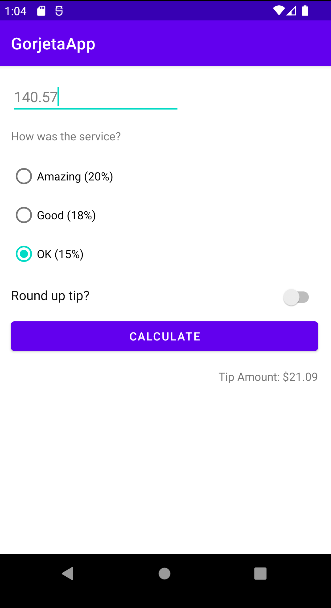

# 💸 | GorjetaApp

GorjetaAPP é um aplicativo que fiz para aprendizado na ETEC Horácio Augusto da Silveira na disciplina de Programação de Aplicações Mobile I (PdAMI).
O aplicativo consiste em uma calculadora de gorjetas, com porcentagens para um atendimento maravilhoso, ótimo e ok.
Utilizamos binding para utilizar os componentes.

<code>OBS: Esse projeto também é ensinado pelo android no site de developers deles, link no final do readme ;)</code>

## 🖼️ | Imagens do aplicativo

 

## ☕ | Linguagem utilizada

  <h3 align="left">Kotlin</h3>

## 🌎 | Links

https://developer.android.com/codelabs/basic-android-kotlin-training-tip-calculator?hl=pt-br#0
